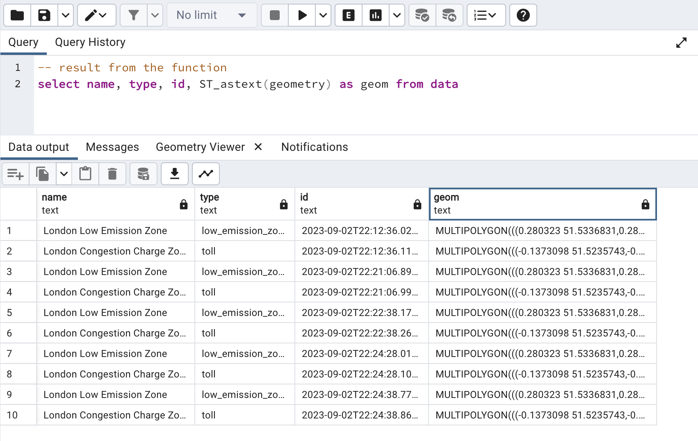

# Spatial Data Engineering with Typescript

A demo of spatial data engineering using postgis, spatial sql, developed using Typescript and executed with nodejs; by [sutan.co.uk](https://sutan.co.uk)

It fetches a geojson data and stores the features in a postgis server. As a demo, we are using a predefined schema:

```typescript
interface data {
    id: string
    name: string
    type: string
    geometry: Geometry
}
```

## Prerequisite

A running Postgresql with postgis extension. You must know the username, password, database, host, and port.

## Running

1. create a ```.env``` file and populate it with the secrets

```bash
# the '.env' file
POSTGRES_USER=user
POSTGRES_HOST=127.0.0.1
POSTGRES_DB=db
POSTGRES_PASSWORD=password
POSTGRES_PORT=5432
```

2. install the dependencies ```npm run i```

3. compile & execute the code ```npm run start```


## Result

after running ```npm run start``` several times, I can view the data inside pgadmin.

